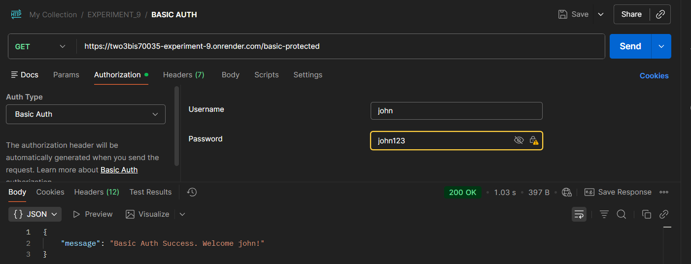
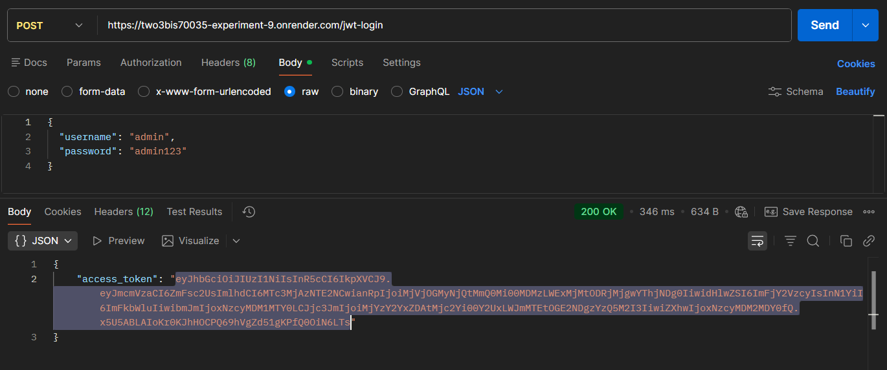
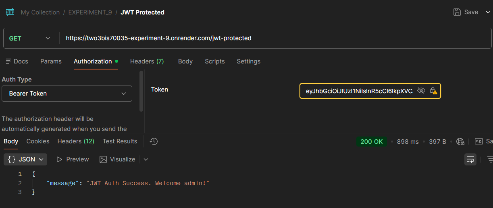

## Experiment No. 8 - Develop RESTful APIs using Backend Framework (Flask)

## Project Structure

```bash
Experiment_9/
├── venv/
│   ├── Include/
│   ├── Lib/
│   └── Scripts/
├── requiement.txt
├── app.py
└── README.md
```

## JWT Methods
|Method      | Header Used           | Stateless? | Secure?     |
|------------|---------------------|----------|----------- |
| Basic Auth   | Authorization         | Yes        | Weak      |
| Base64 Token | x-auth-token          | Yes        | Very Weak |
| JWT          | Authorization: Bearer | Yes        | ✅ Strong    |


## STEPS & SCREENSHOTS
### 1. Server Start & Running

Render development server successfully started.

### 2. READ ALL Students (GET)


Not added any student data till now

### 3. CREATE Student (POST)


### Create Another Student


### 4. READ ALL Students (GET)


### 5. READ ONE Student
### GET Student ID = 1


### GET Student ID = 2


### 6. UPDATE Student (PUT)


### 7. DELETE Student

### READ After Deletion


## API Endpoints Summary
| Method | Endpoint | Description |
|--------|----------|------------|
| POST   | /students | Create new student |
| GET    | /students | Get all students |
| GET    | /students/<id> | Get student by ID |
| PUT    | /students/<id> | Update student |
| DELETE | /students/<id> | Delete student |

## Learning Outcome
- Learnt about backend technologies
- Learnt to create virtual enviroment of python using venv
- Leant to code in flask
- Learnt about flask in python
- Learnt to route in flask