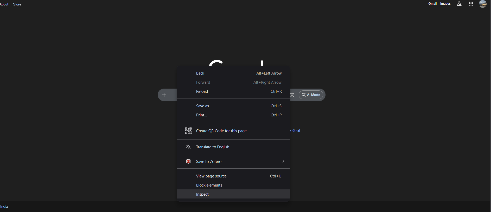
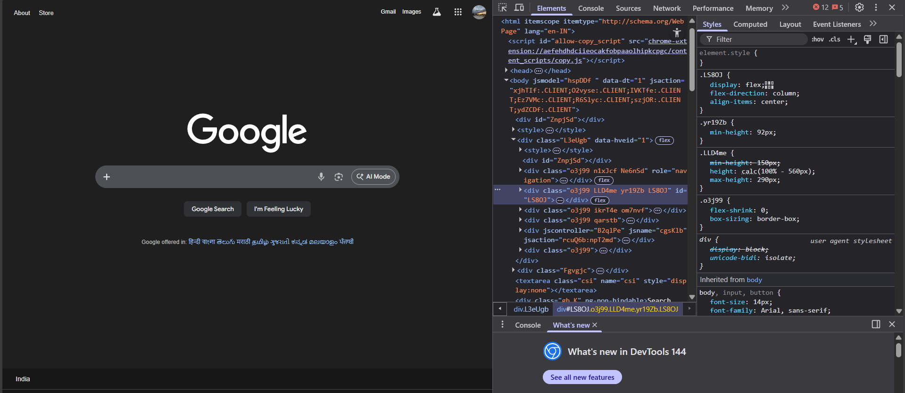
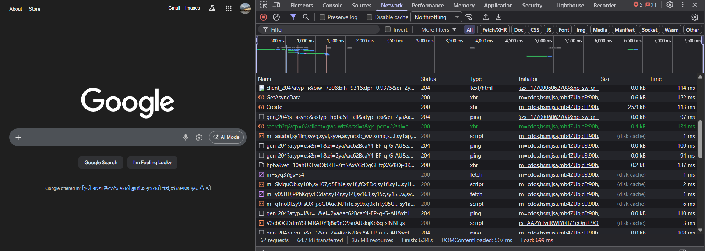
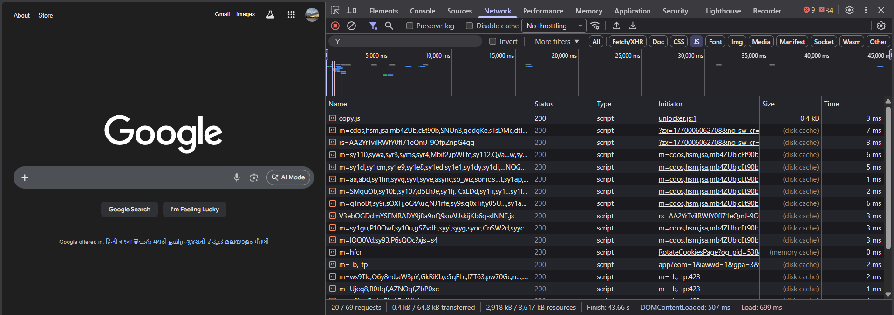
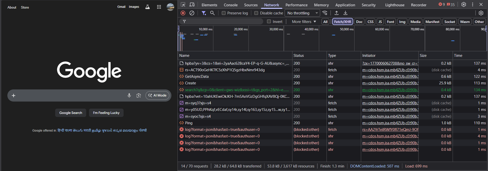
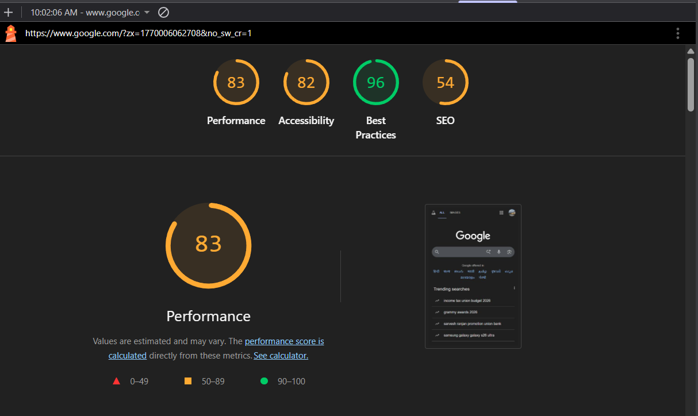
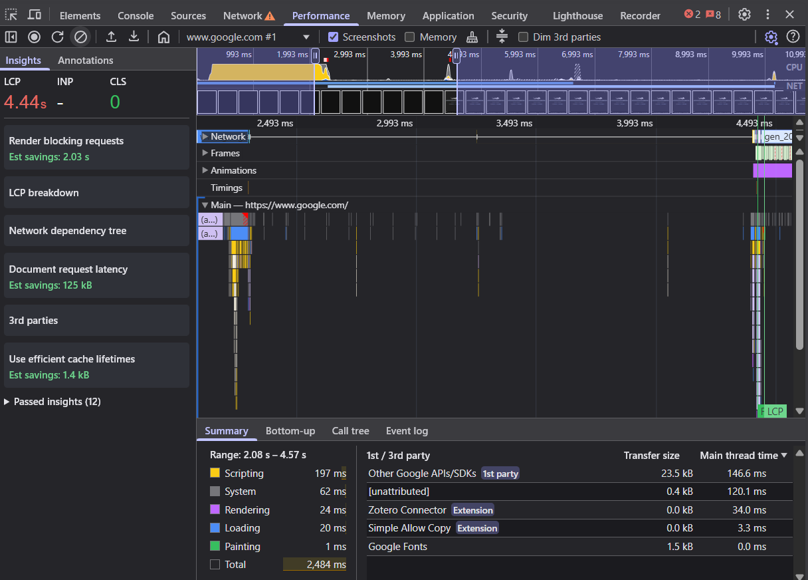
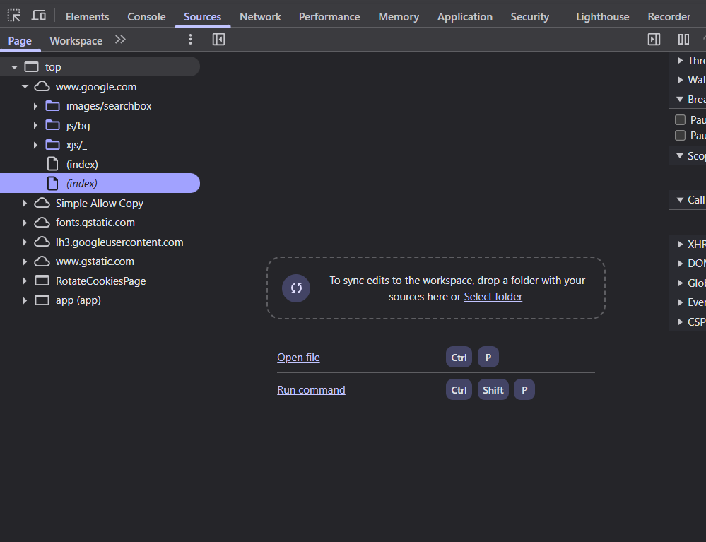
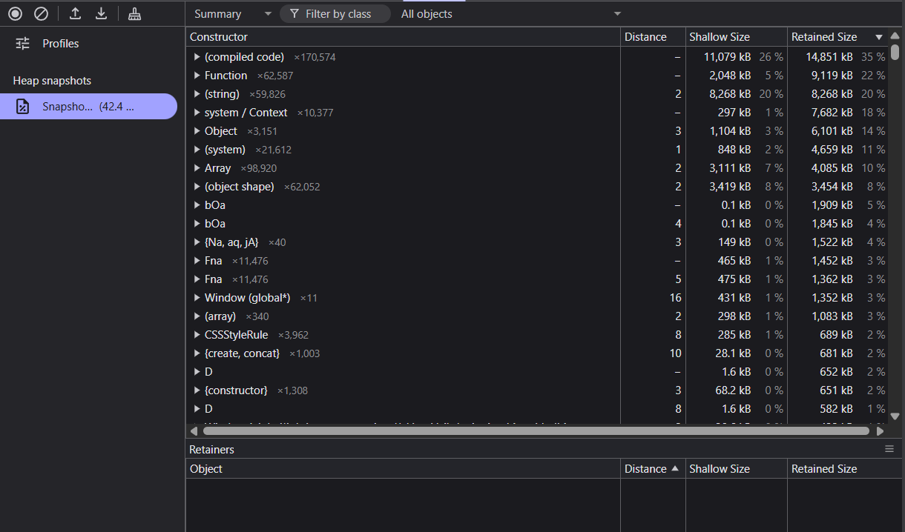
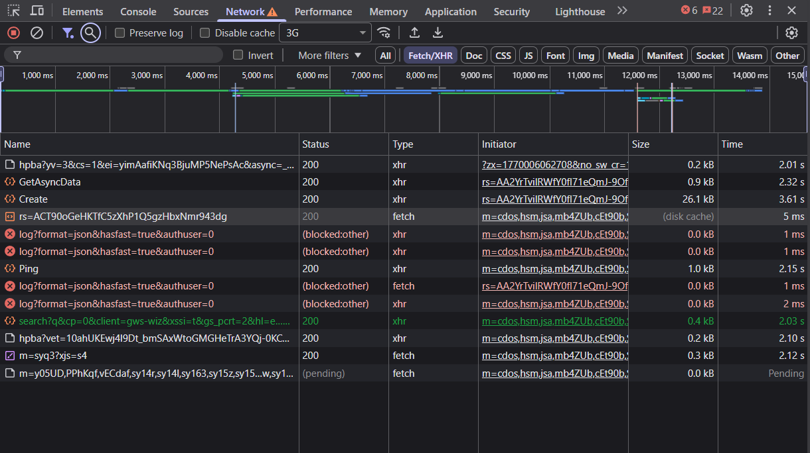

# Frontend Performance Analysis Using Browser Developer Tools (Google Chrome)

## 1. Aim

To analyze and evaluate frontend performance of a web application using Developer Tools and identify optimization opportunities such as Microsoft Edge Developer Tools.

---

## 2. Learning Objectives

- Understand frontend performance metrics
- Analyze network requests and API calls
- Measure rendering and interaction performance
- Use Lighthouse for performance auditing
- Simulate real-world network conditions
- Identify optimization techniques

---

## 3. Theory

Frontend performance refers to how quickly a web page loads, renders, and responds to user interactions. Key factors include network latency, JavaScript execution, rendering time, and third-party scripts.

Microsoft Edge DevTools (Chromium-based) provide comprehensive tools such as:

- Elements
- Network
- Performance
- Memory
- Lighthouse

These tools help developers debug, analyze, and optimize web applications efficiently.

---

## 4. Key Performance Metrics

| Metric      | Description               |
| ----------- | ------------------------- |
| FCP         | First Contentful Paint    |
| LCP         | Largest Contentful Paint  |
| CLS         | Cumulative Layout Shift   |
| INP         | Interaction to Next Paint |
| TTI         | Time to Interactive       |
| API Latency | Backend response time     |

---

## 5. Tools Used

- Microsoft Edge Browser
- Edge Developer Tools
- Network Panel
- Performance Panel
- Memory Panel
- Lighthouse

---

## 6. Step-by-Step Procedure

### 6.1 Opening DevTools

- Open website (https://www.google.com)
- Right click → Inspect
  
- OR Press F12
- Edge Developer Tools will open
  

### 6.2 Network Analysis (No Throttling)

- Open Network tab
- Reload page
- Analyze JS, XHR, images, fonts, API Calls
  

### 6.3 Elements Inspection

- Inspect DOM structure
- Analyze applied CSS and layout

### 6.4 Performance Recording

- Open Performance tab
- Click Record → Reload page
- Analyze main thread, scripting, rendering



### 6.5 Core Web Vitals

- Observe LCP, CLS, INP metrics



### 6.6 Lighthouse Audit

- Open Lighthouse tab
- Run audit (Desktop)

Performance Score: 95  
Accessibility: 90  
Best Practices: 96  
SEO: 91



### 6.7 Network Throttling (3G Simulation)

- Change Network to 3G
- Reload page
- Observe delayed loading



### 6.8 Disable Cache Test

- Enable Disable Cache
- Reload page
- Compare load times



### 6.9 Memory Analysis

- Open Memory tab
- Take Heap Snapshot
- Observe memory usage



### 6.10 Sources Tab

- View loaded scripts and source mapping



---

## 7. Sample Heavy Component (Theory)

```javascript
function HeavyComponent() {
  for (let i = 0; i < 1000000; i++) {}
  return <h3>Heavy Component Loaded</h3>;
}
```

This simulates CPU-intensive work affecting performance.

---

## 8. Observations

- Multiple JavaScript and XHR requests observed
- LCP under 1 second (excellent)
- CLS = 0 indicating stable layout
- INP below 100 ms showing responsive UI
- Performance degrades under 3G throttling
- Cached resources load faster
- No memory leaks observed

---

## 9. Optimization Techniques

- Lazy loading components
- Minifying JavaScript
- Using CDN
- Reducing third-party scripts
- Memoization
- Code splitting

---

## 10. Conclusion

Frontend performance analysis using Microsoft Edge Developer Tools provides deep insights into network, rendering, and interaction performance. Tools like Network, Performance, Memory, and Lighthouse help identify bottlenecks and guide effective optimization strategies, resulting in improved user experience.

---
